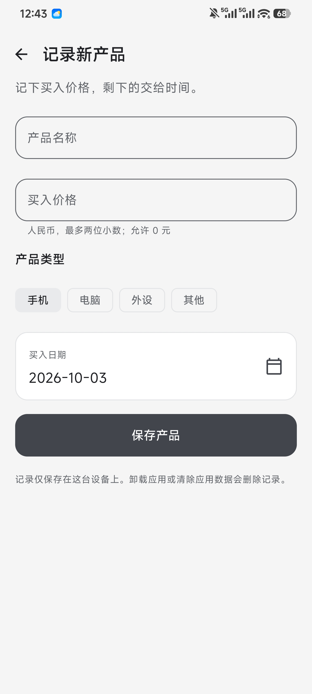
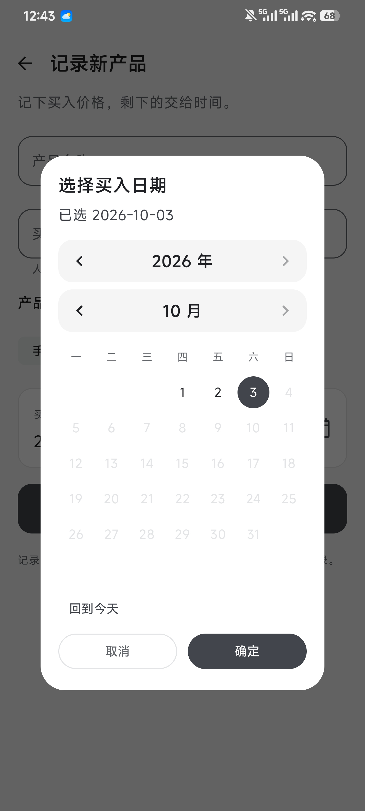
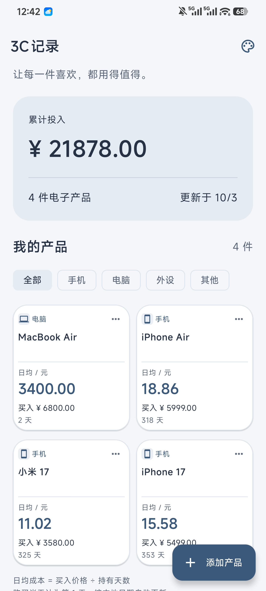
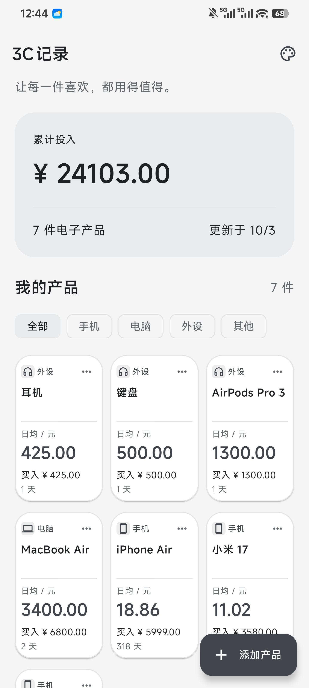
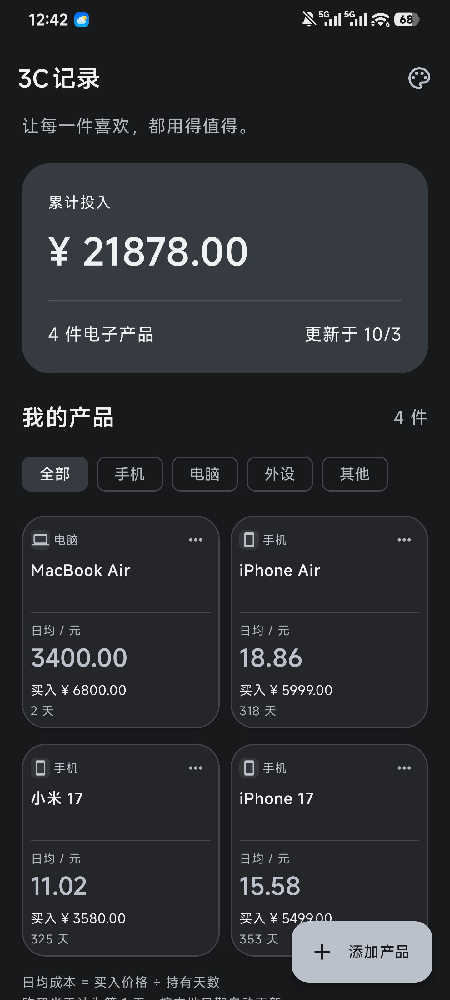

# 3C记录 · 使用说明

让每一件喜欢，都用得值得。

「3C记录」是一款记录电子产品买入价格、购买日期和日均成本的安卓应用。支持手机、电脑、外设及其他产品分类，使用简体中文界面，无需注册，可离线使用。

## 安装与开始使用

- 支持 Android 8.0 及以上设备。
- 将应用 APK 安装到手机后，打开「3C记录」即可开始使用。
- 首次打开时没有产品记录，点击右下角「添加产品」录入第一件产品。

## 1. 添加产品

点击首页右下角「添加产品」，进入「记录新产品」页面，依次填写以下信息：

| 项目 | 填写说明 |
| --- | --- |
| 产品名称 | 必填，最多 60 个字，例如 MacBook Air、无线耳机。 |
| 买入价格 | 以人民币元为单位，允许 0 元，最多 9 位整数和 2 位小数。 |
| 产品类型 | 选择「手机」「电脑」「外设」或「其他」。 |
| 买入日期 | 默认今天，可修改为实际购买日期，范围为 1970 年 1 月 1 日至今天。 |

输入有效价格后，页面会预览截至今天的持有天数和日均成本。填写完成后点击「保存产品」，即可在首页查看记录。



### 选择买入日期

1. 点击表单中的「买入日期」区域，打开日历。
2. 使用年份左右箭头切换年份，使用月份左右箭头切换月份。
3. 点击具体日期，再点击「确定」将所选日期填入表单。

点击「回到今天」可选中当天日期；点击「取消」保留原日期。未来日期不可选择。



## 2. 查看产品与累计投入

首页顶部的「累计投入」显示所有现有产品的买入价格总和及产品总数。下方「我的产品」展示产品卡片，按买入日期从新到旧排列。

每张卡片显示产品名称、类型、买入价格、持有天数和日均成本。单列卡片还会显示买入日期；多列卡片采用紧凑布局，如需查看完整名称或买入日期，可进入该产品的编辑页面。

卡片列数根据全部产品数量自动调整：

| 产品总数 | 展示方式 |
| --- | --- |
| 1–3 件 | 单列 |
| 4–6 件 | 双列 |
| 7 件及以上 | 三列 |

产品较多时可向下滚动查看。

<p>
  
  
</p>

### 按分类筛选

点击「全部」「手机」「电脑」「外设」「其他」切换查看范围。「我的产品」右侧数量随筛选结果变化，顶部「累计投入」和产品总数始终统计全部现有产品，卡片列数也保持不变。

## 3. 编辑或删除产品

### 编辑记录

1. 找到需要修改的产品，点击卡片右上角「…」。
2. 选择「编辑」，修改名称、价格、类型或买入日期。
3. 点击「保存产品」，首页会重新计算累计投入及该产品的日均成本。

### 删除记录

1. 点击产品卡片右上角「…」，选择「删除」。
2. 在确认弹窗中核对产品名称。
3. 点击「删除」移除记录，或点击「取消」保留记录。

删除后无法恢复，累计投入和产品数量会相应减少。

## 4. 切换配色

点击首页右上角的调色盘图标，打开「选择配色」，点击喜欢的配色即可即时应用，再点击「完成」返回首页。

提供石墨白、雾蓝灰、鼠尾草、暖燕麦、克制靛蓝、冰川青、深海蓝白、摩卡奶油、炭黑银、黑曜烟紫共 10 套配色，默认使用克制靛蓝。其中炭黑银、黑曜烟紫为深色主题。

配色选择会自动保存，重新打开应用后仍保留；深浅色由手动选择，不随系统外观自动切换。



## 5. 日均成本如何计算

```text
持有天数 = 今天的本地日期 − 买入日期 + 1
日均成本 = 买入价格 ÷ 持有天数
```

购买当天计为第 1 天，金额四舍五入保留两位小数。例如，一部 6000 元的手机在 2026 年 10 月 1 日买入：

| 查看日期 | 持有天数 | 日均成本 |
| --- | --- | --- |
| 2026 年 10 月 1 日 | 1 天 | 6000.00 元/天 |
| 2026 年 10 月 2 日 | 2 天 | 3000.00 元/天 |
| 2026 年 10 月 3 日 | 3 天 | 2000.00 元/天 |

日均成本按持有的自然日计算，不统计实际开机或使用时长。应用按手机本地日期自动更新，回到前台时也会刷新。如果系统日期被调到购买日期之前，持有天数最低按 1 天计算。

## 数据保存与常见问题

### 需要联网或登录吗？

不需要。应用无需注册或登录，没有网络权限，不接入广告、统计或云同步。

### 关闭应用后，记录还在吗？

在。记录保存在当前设备，关闭后重新打开仍可查看。卸载应用或清除应用数据会删除记录；目前不支持导出备份或跨设备同步。

### 为什么无法保存？

请根据页面提示检查：产品名称不能为空且不超过 60 个字；价格不能为负数，最多 9 位整数和 2 位小数；买入日期不能早于 1970 年 1 月 1 日，也不能晚于今天。

### 为什么切换分类后，累计投入没有变化？

分类筛选只改变下方产品列表的展示范围，累计投入始终统计所有现有产品。

### 为什么刚买的产品日均成本等于买入价格？

购买当天计为第 1 天，因此当天日均成本等于买入价格。持有天数增加后，日均成本会逐渐降低。
